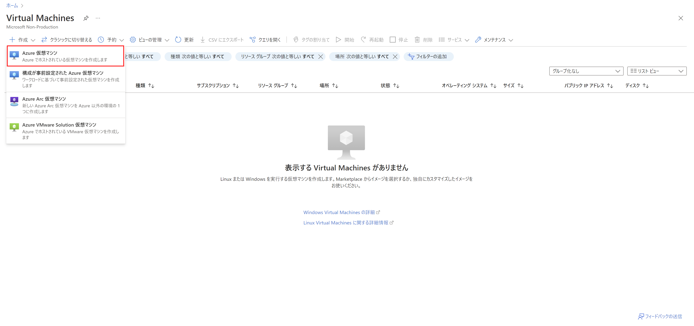
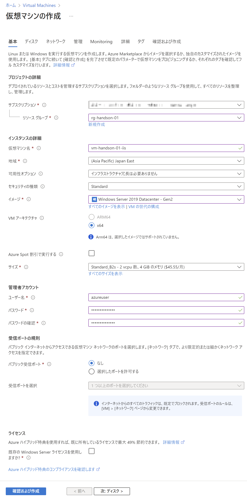
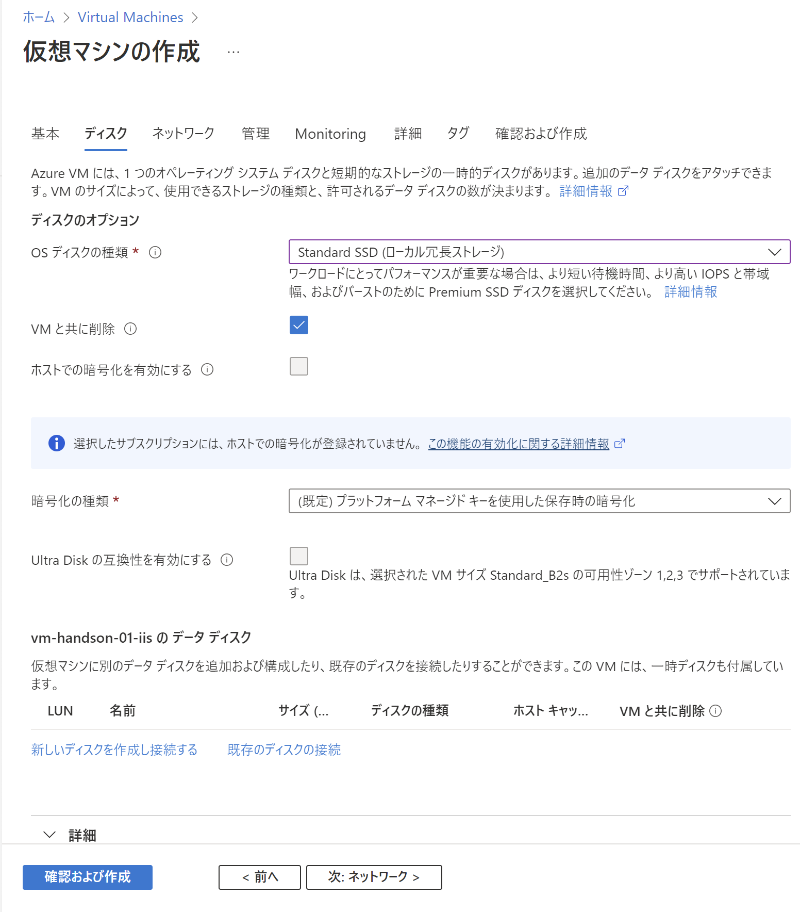
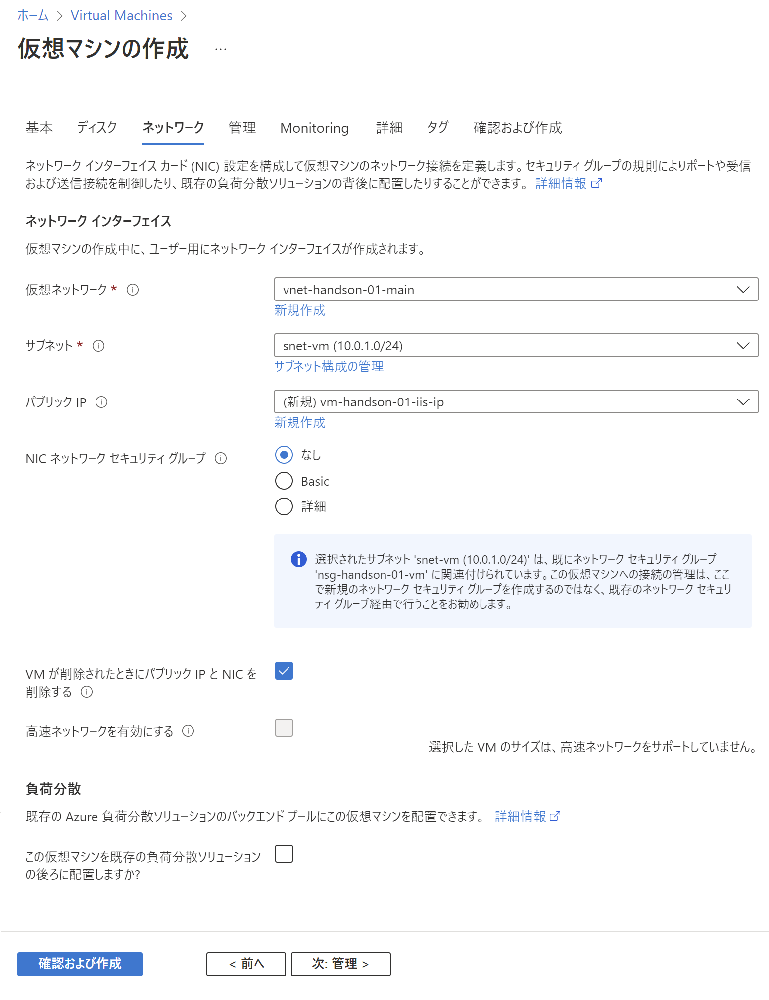
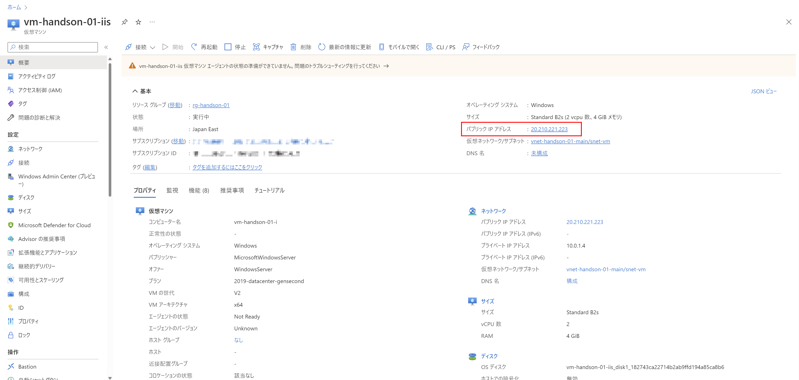
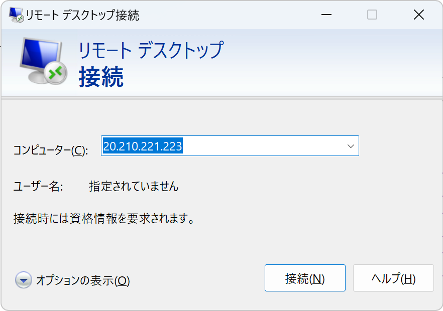
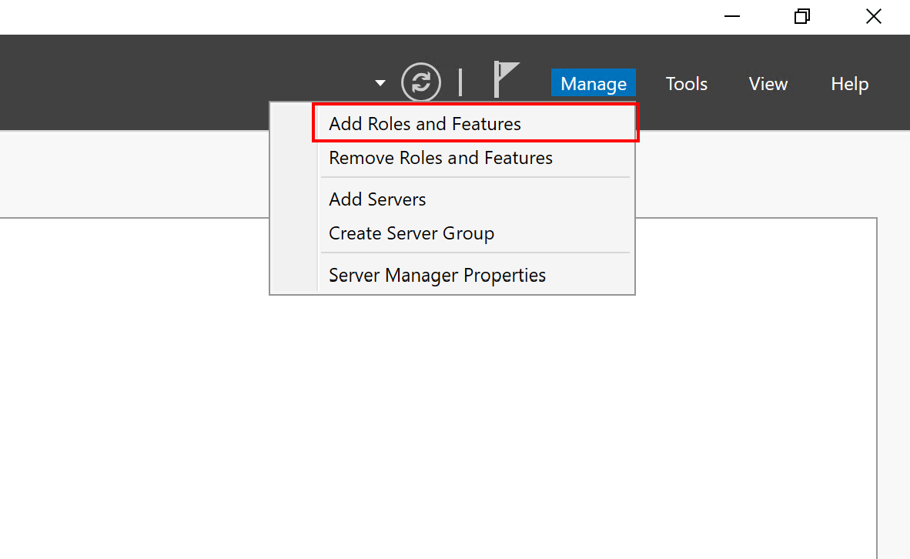

# Exercise3: 仮想マシン作成/接続

## 【目次】

1. [Windows Server 仮想マシン作成](#windows-server-仮想マシン作成)
1. [RDP接続](#rdp接続)
1. [IISインストール](#iisインストール)
1. [パブリックIPでアクセス](#パブリックipでアクセス)

## Windows Server 仮想マシン作成

1. Azureポータル上部の検索窓で「Virtual Machines」を検索、「Virtual Machines」を開く

1. [作成]-[Azure 仮想マシン]を選択

    

1. 仮想マシンを作成

    1. 「基本」ページ

        * リソースグループ：（作成済みのリソースグループ）
        * 仮想マシン名：（任意）
        * 地域： `Japan East`
        * イメージ： `Windows Server 2019 Datacenter`
        * サイズ： `Standard_B2s`
        * ユーザー名、パスワード：（任意）
        * パブリック受信ポート： `なし`

        

    1. 「ディスク」ページ

        * OSディスクの種類： `Standard SSD`
        * VMとともに削除： `有効(チェック状態)`

        

    1. 「ネットワーク」ページ

        * 仮想ネットワーク： （作成済みの仮想ネットワーク）
        * サブネット： （作成済みの仮想マシン用サブネット）
        * パブリックIP： （新規作成。名称は任意）
        * NICネットワークセキュリティグループ： `なし`
        * VMが削除されたときにパブリックIPとNICを削除する： `有効(チェック状態)`

        

    1. 「管理」ページ

        * 自動シャットダウン： `有効`
        * シャットダウン前の通知： `無効`

    1. 「Monitoring」ページ

        * Boot diagnotics ： `Disable`
    
    1. 「詳細」ページ

        特に設定なし

    1. 「タグ」ページ

        特に設定なし

    1. 「確認および作成」ページ

        内容を確認して「作成」

## RDP接続

1. 作成した仮想マシンのページを開く

1. 「概要」に表示される「パブリックIPアドレス」を確認

    

1. 確認したIPアドレスに対してRDP接続を行う

    * ユーザー名、パスワード： （仮想マシン作成時に設定したもの）

    

1. 接続できればOK

    接続できない場合はネットワークセキュリティグループの設定を確認

    

## IISインストール

1. [Manage]-[Add Roles and Features]を開く

    

1. ウィザードに従って「IIS」を追加

    1. Before you begin

        「Next」を選択

    1. Select installation type

        「Role-based or feature-based installation」を選択して「Next」

    1. Select destination server

        そのまま「Next」
    
    1. Select server roles

        `Web Server (IIS)` を選択、機能追加内容を確認して追加、「Next」

    1. Select features

        そのまま「Next」

    1. Web Server Role (IIS)

        そのまま「Next」

    1. Select role services

        デフォルトのまま「Next」
    
    1. Confirm installation selections

        そのまま「Install」

  1. インストール完了後、以下にアクセスしてデフォルトページが表示されることを確認

      `http://localhost/`

      

## パブリックIPでアクセス

1. 確認済みのパブリックIPアドレスに対してブラウザでアクセス

      

